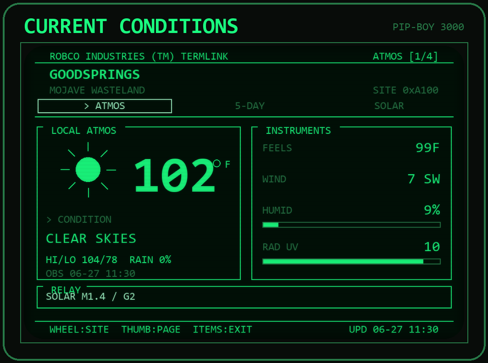
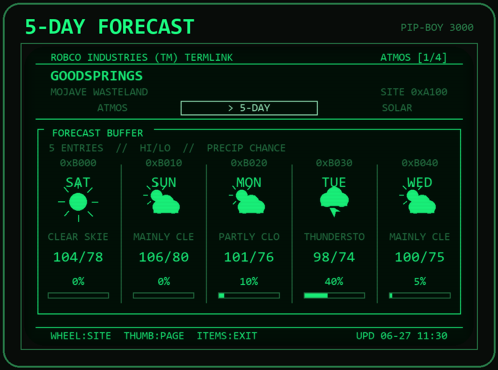
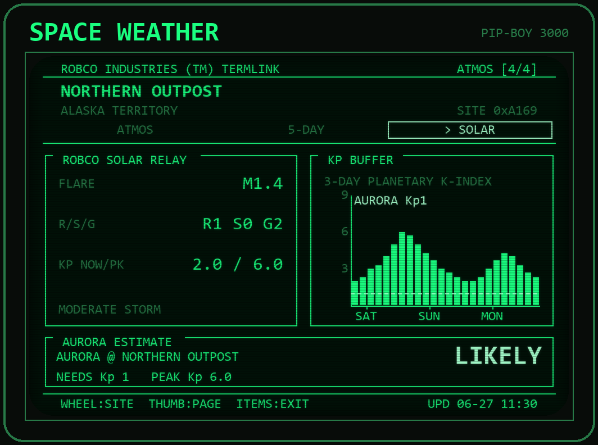
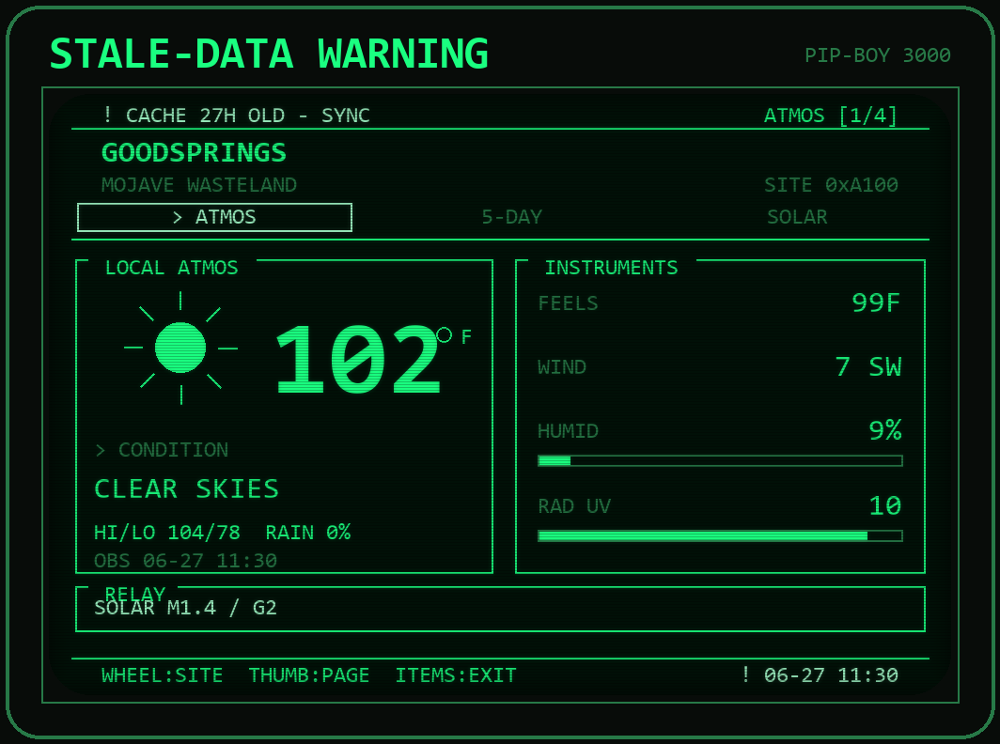
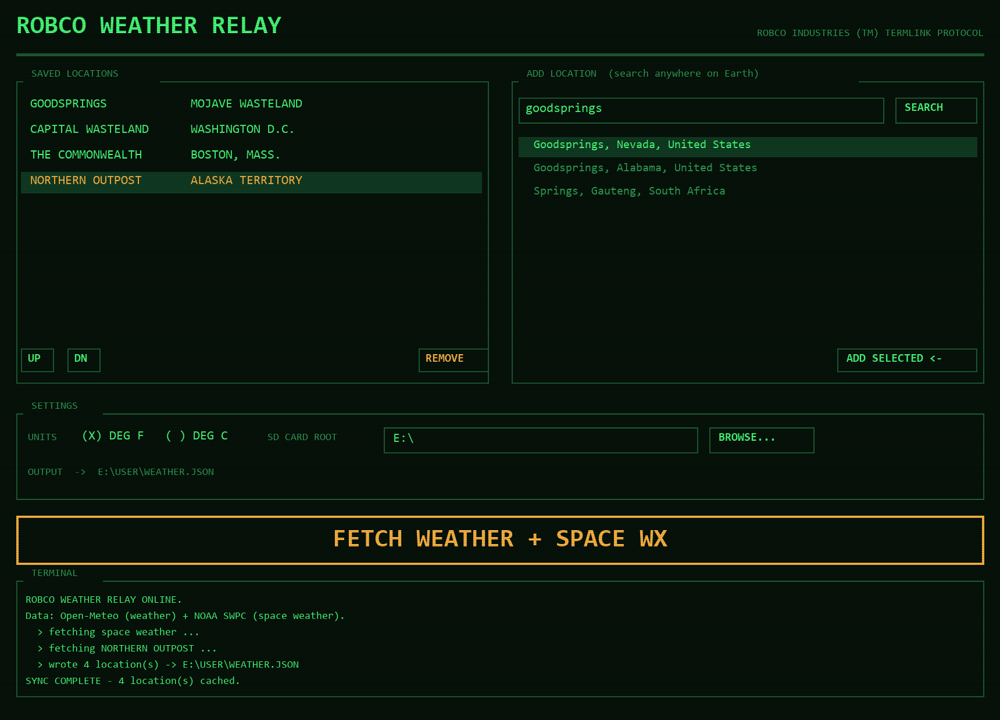

# RobCo Weather

RobCo Weather is a cached weather and space-weather terminal for The Wand
Company Pip-Boy 3000. It pairs a Python companion app with an on-device
Espruino app so the Pip-Boy can show useful weather data without needing live
network access.

The companion runs on a computer or phone, fetches data from Open-Meteo and
NOAA SWPC, writes `WEATHER.JSON` to the Pip-Boy SD card, and the Pip-Boy app
renders the cached data in a Fallout 3 / New Vegas style interface.

## What It Includes

- Current conditions for any saved location.
- 5-day forecast with high, low, condition, and precipitation chance.
- Space-weather view with solar flare class, R/S/G scales, current Kp, and a
  3-day Kp forecast graph.
- Per-location aurora estimate based on latitude and forecast Kp.
- Stale-cache warning when the synced data is more than 12 hours old.
- Graphical companion app and interactive/scriptable CLI.
- Preview renderer for screenshots and a generator for the app holotape icon.

## Quick Start

1. Run the companion GUI:

   ```bash
   python companion/pipboy_weather_gui.py
   ```

2. Add or reorder locations and choose `F` or `C`.

3. Press `INSTALL / UPDATE DEVICE`, then select the SD card root. This copies:

   ```text
   pipboy/APPS/WEATHER.JS          -> APPS/WEATHER.JS
   pipboy/APPINFO/WEATHER.info     -> APPINFO/WEATHER.info
   pipboy/APPINFO/WEATHER.IMG      -> APPINFO/WEATHER.IMG
   ```

   It also downloads Open-Meteo weather and NOAA SWPC space weather, then
   writes `USER/WEATHER.JSON`.

4. Reboot the Pip-Boy. The app appears in `ITEMS > MISC` as `Weather`.

The companion writes the cache to `<SD>/USER/WEATHER.JSON`. If no SD path is
set, it writes `companion/WEATHER.JSON` so you can copy it manually.

## Previews

The preview images are generated from `sample/WEATHER.JSON` by
`companion/render_preview.py`.

| Current | Forecast |
| --- | --- |
|  |  |

| Space Weather | Stale Cache |
| --- | --- |
|  |  |

Companion GUI:



## Documentation

- [Installation](docs/INSTALLATION.md): SD card layout, first sync, updates,
  uninstalling, and verification.
- [Companion App](docs/COMPANION.md): GUI, CLI, scripted use, configuration,
  locations, and data sources.
- [Pip-Boy App](docs/PIPBOY_APP.md): controls, views, stale-data handling,
  firmware notes, and app metadata.
- [Data Format](docs/DATA_FORMAT.md): `WEATHER.JSON` schema and compatibility
  rules.
- [Development](docs/DEVELOPMENT.md): repository layout, validation commands,
  preview/icon generation, and release checklist.
- [Troubleshooting](docs/TROUBLESHOOTING.md): common install, sync, display,
  and data problems.

## Repository Layout

```text
.
|-- companion/
|   |-- pipboy_weather_gui.py    # Tkinter companion UI
|   |-- pipboy_weather.py        # fetch/write engine and CLI
|   |-- make_icon.py             # regenerates APPINFO/WEATHER.IMG
|   `-- render_preview.py        # renders preview PNGs, requires Pillow
|-- docs/                        # detailed documentation
|-- pipboy/
|   |-- APPS/WEATHER.JS          # on-device Espruino app
|   `-- APPINFO/
|       |-- WEATHER.info         # Pip-Boy app metadata
|       `-- WEATHER.IMG          # 1-bpp holotape icon
|-- previews/                    # generated screenshots
`-- sample/WEATHER.JSON          # simulator and preview sample cache
```

## Requirements

- Pip-Boy 3000 SD card access through USB-C file manager or direct microSD
  access.
- Python 3 for the companion.
- Tkinter for the GUI. Most desktop Python installs include it.
- Internet access only on the companion device during sync.
- Optional: Pillow for `companion/render_preview.py`.

No API keys are required. Weather comes from
[Open-Meteo](https://open-meteo.com), and space weather comes from
[NOAA SWPC](https://www.swpc.noaa.gov).

## Safety Notes

Back up the Pip-Boy SD card before installing or replacing files. The project
only needs three app files plus `USER/WEATHER.JSON`, but a full backup makes it
easy to restore the original card state if firmware expectations differ.

The Pip-Boy app reads cached data only. Re-run the companion whenever you want
fresh weather.
